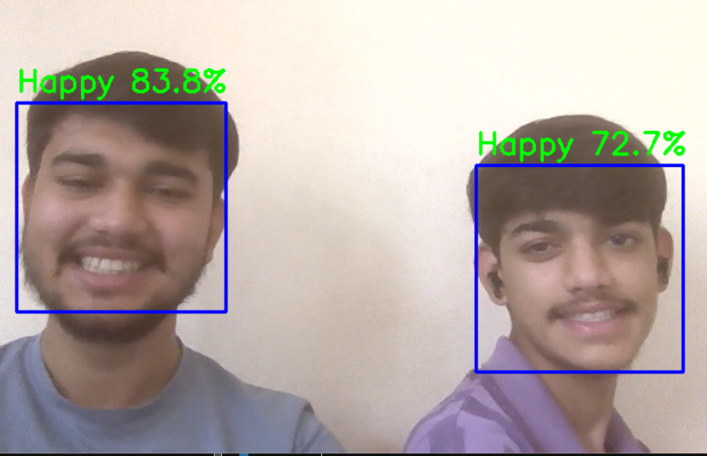
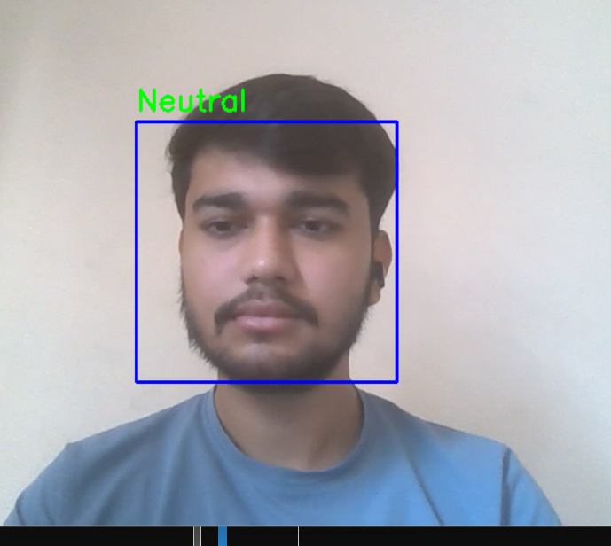
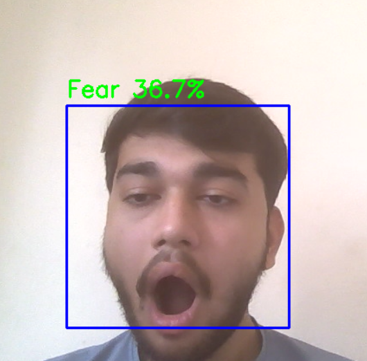

# Emotion Detection using CNN

Real-time facial emotion detection using TensorFlow, Keras and OpenCV.

## Features

- Detects 7 emotions
- Real-time webcam prediction
- Confidence score display
- Trained on FER2013 dataset

## Emotions

- Angry
- Disgust
- Fear
- Happy
- Sad
- Surprise
- Neutral

## Technologies

- Python
- TensorFlow/Keras
- OpenCV
- NumPy
- Scikit-learn

## Dataset

FER2013

## Model Architecture

CNN with:
- Conv2D
- Batch Normalization
- Max Pooling
- Dropout
- Softmax

## Results

Validation Accuracy: 58.4% (Still improving)

## Demo Gallery









## Run

```bash
pip install -r requirements.txt
python webcam_emotion.py
```